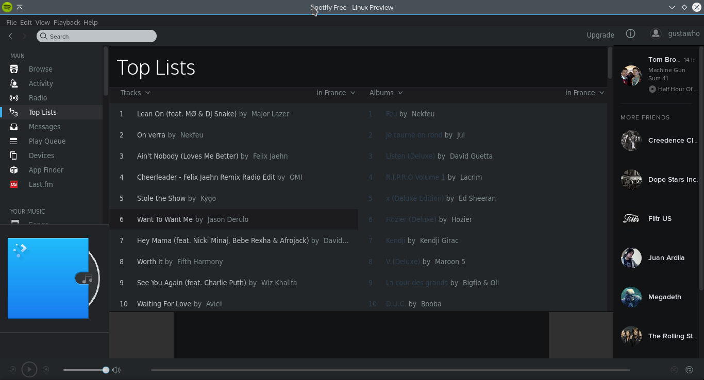
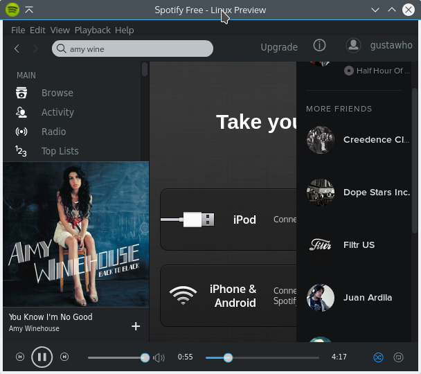
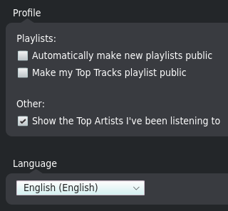
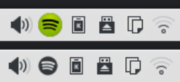

# spotify-kde-integration

> Integrate Spotify with Breeze, the default visual style in KDE Plasma 5.x

## Installation

Run this one-liner to automatically install and run the script:

```bash
$ wget --no-check-certificate http://bit.ly/spotify-kde -O - | sh
```
## Usage

When you update Spotify all the files will be overwritten, so you must re-apply the skin. Just run

```bash
$ spotify-kde-integration
```
## Screenshots



 